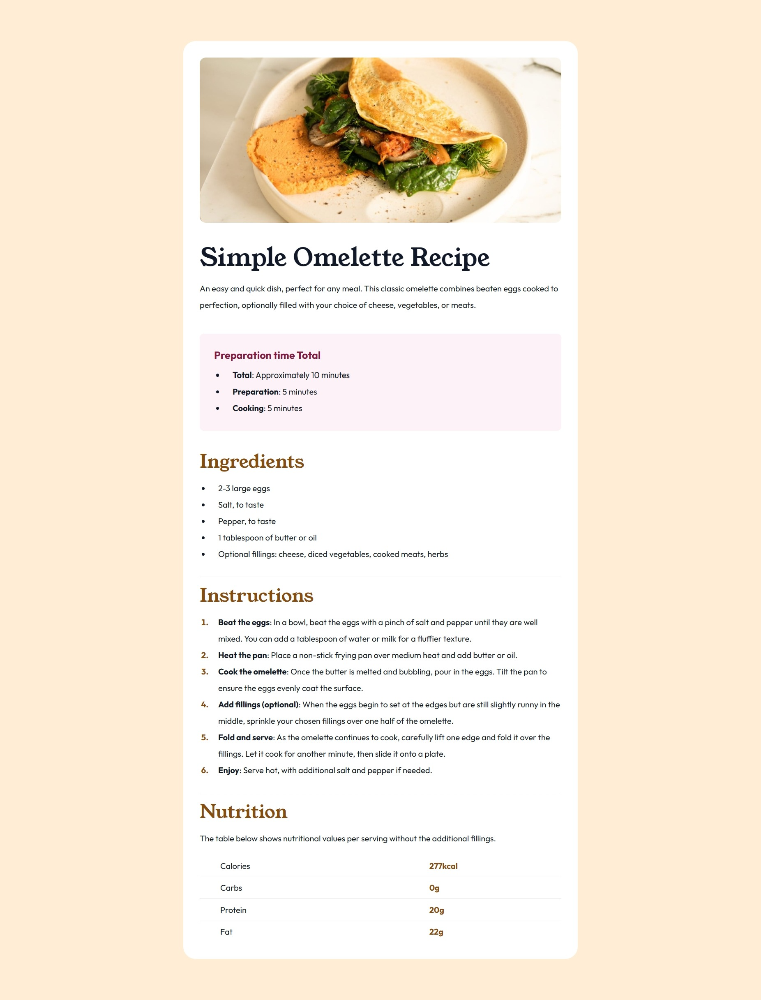
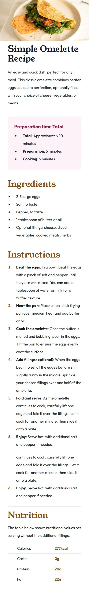

# Frontend Mentor - Recipe page solution

This is a solution to the [Recipe page challenge on Frontend Mentor](https://www.frontendmentor.io/challenges/recipe-page-KiTsR8QQKm). Frontend Mentor challenges help you improve your coding skills by building realistic projects.

## Table of contents

- [Overview](#overview)
  - [The challenge](#the-challenge)
  - [Screenshot](#screenshot)
  - [Links](#links)
- [My process](#my-process)
  - [Built with](#built-with)
- [Author](#author)

## Overview

### The challenge

The challenge is to build out the recipe page and get it looking as close to the given design as possible.

### Screenshot

- Desktop version
  
- Mobile version
  

### Links

- Solution URL: [Github](https://github.com/MouniaBelkheir/recipe)
- Live Site URL: [Recipe page website](https://recipe-five-rouge.vercel.app/)

## My process

### Built with

- Semantic HTML5 markup
- TailwindCSS
- Flexbox
- Mobile-first workflow
- Responsive design

## Author

- Website - [Mounia Belkheir](https://mouniabelkheir.vercel.app/)
- Frontend Mentor - [Mounia Belkheir](https://www.frontendmentor.io/profile/MouniaBelkheir)
- LinkedIn - [Mounia Belkheir](https://www.linkedin.com/in/mouniabelkheir/)
